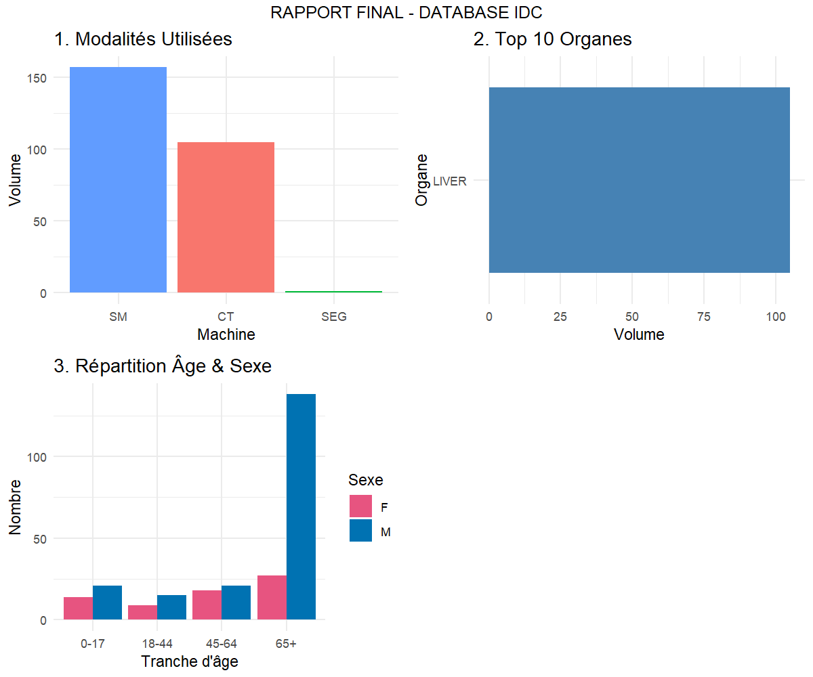

## À propos de ce projet

**Raounek – Data Analyst**  
Ce projet montre mes compétences en analyse de données médicales, visualisation et reporting interactif.  
Il illustre l’utilisation de **R, ggplot2, BigQuery et R Markdown** pour produire un rapport professionnel.

# Analyse de l’Imagerie Médicale – IDC

## Présentation du projet

Ce projet consiste en une analyse exploratoire des données issues de  
**l’Imaging Data Commons (IDC)**, une base de données médicale internationale  
dédiée à l’imagerie clinique et à la recherche en oncologie.

L’objectif est de :  
- Identifier les **modalités d’imagerie** les plus utilisées  
- Mettre en évidence les **organes les plus étudiés**  
- Analyser la **répartition démographique (âge & sexe)** des patients  
- Produire un **rapport professionnel clair et lisible**

---

## Rendu final (HTML)


```{r, echo=FALSE, out.width='80%'}

```


> Rapport interactif généré avec **R Markdown**, contenant uniquement  
> les analyses, graphiques et conclusions (code masqué).

---

##  Code source de l’analyse

 **Script R complet utilisé pour l’analyse :**  
  [ Script complet analyse_idc.R](analyse_idc.R){target="_blank"}


Ce script contient :
- La connexion à Google BigQuery  
- Le nettoyage et la préparation des données  
- La génération des graphiques (ggplot2)  
- La structuration de l’analyse

---

## ️ Technologies utilisées

- **R / RStudio**
- **R Markdown**
- **tidyverse**
- **ggplot2**
- **Google BigQuery**
- **SQL**

---

##  Résultats clés

- Forte dominance des modalités **CT** et **SM**
- Organes majoritairement étudiés : **foie et thorax**
- Population principalement **senior (65+)**
- Données adaptées à des usages en **IA médicale**


---


##  Auteur

**Raounek**  
Data Analyst  
2025
